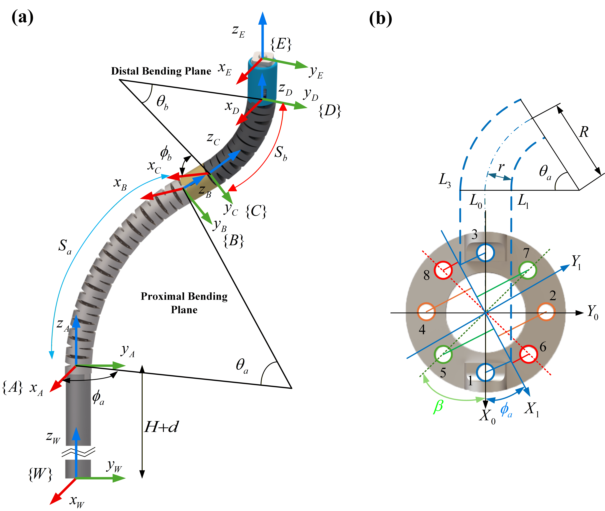

# TDRC-J2T 中文版readme

该项目是一个将关节空间转换为肌腱空间的TDRC（肌腱驱动连续机器人）机器人的演示。代码同时使用C++和Python实现，并使用NumPy库进行数值计算。

## 公式推导
该项目针对的连续体机器人是一个刚柔耦合连续体机械臂，具备一个刚性基座、直线单元和一个双段连续体段，其中连续体段由两个连续体单元组成，各具备两个正交的弯曲自由度。
靠近基座的连续体段称作近段连续体（Proximal Segment），远离基座的连续体段称作远段连续体（Distal Segment）。
在该项目中，我们使用基于恒曲率假设的连续体机器人运动学模型，来推导关节空间到肌腱空间的转换公式。

### 关节空间到肌腱空间的转换关系
连续体段的运动学分析基于恒曲率假设，即每个连续体段在弯曲时保持恒定的曲率。坐标系定义和参数化如图所示：

由于近段和远段连续体之间存在过渡段，因此在符号上将近段表示为$a$，远端表示为$c$（过渡段为$b$）。对于每个连续体段，我们定义了以下参数：
- $\phi_a$: 近段弯曲平面角度
- $\theta_a$: 近段弯曲角度
- $\phi_c$: 远段弯曲平面角度
- $\theta_c$: 远段弯曲角度
- $l_a$: 近段长度
- $l_c$: 远段长度

图1(b)中展示了离散连续体关节驱动丝孔位与驱动丝弯曲平面角度和弯曲角度的关系，图中特别展示的是近段连续体的驱动丝孔位与$\phi_a$和$\theta_a$的关系，远段离散关节与其类似，但是缺少两对驱动丝孔位（因为远端连续体的驱动丝需要穿过近段连续体，因此近段连续体需要保留与远段连续体相关的驱动丝孔位）。

通过分析，容易得出，当$\phi_a$和$\theta_a$确定后，穿过各孔的驱动丝长度在该段连续体中的长度就确定了，其长度变化量的大小，与离散关节圆心到该孔的距离在弯曲平面上的的投影成正比，具体推导如下：

首先，将孔位进行标号，如图中所示，驱动近段连续体的孔位分别为$h_{a1}$、$h_{a2}$、$h_{a3}$、$h_{a4}$，远段连续体的孔位分别为$h_{c5}$、$h_{c6}$、$h_{c7}$、$h_{c8}$。其中，$h_{a5}$、$h_{a6}$、$h_{a7}$、$h_{a8}$分别为远段连续体的驱动丝孔位在近段连续体中的对应孔位。然后对每根驱动丝也进行编号，$t_1, t_2,...,t_8$分别与相应下标的孔位对应。对于近段连续体，驱动丝长度的变化量$\Delta l_{ai}$（其中$i=1,2,3,4$）与离散关节圆心到孔位$h_{ai}$的距离在弯曲平面上的投影成正比，即：

$$\Delta l_{ai} = r \theta_a \cos(\gamma_{ai} - \phi_a), \qquad i\in\{1,2,3,4\}$$

其中，$r$为离散关节圆心到孔位的距离，$\gamma_{ai}$为孔位$h_{ai}$为离散关节圆心的极角，具体定义如下：

$$\gamma_{ai}=(i-1)\frac{\pi}{2}, \qquad i\in\{1,2,3,4\}.$$

此处很好理解：由于驱动孔是均匀、等半径分布，对于近段连续体，一共有8个驱动孔，其中4个用于近段连续体，4个用于远段连续体。对于近段连续体的驱动孔，相对于局部坐标系的X轴，孔位$h_{a1}$、$h_{a2}$、$h_{a3}$、$h_{a4}$分别位于离散关节圆心的0度、90度、180度和270度位置，因此其极角$\gamma_{ai}$分别为0、$\pi/2$、$\pi$和$3\pi/2$。对于远段连续体的驱动孔，孔位$h_{c5}$、$h_{c6}$、$h_{c7}$、$h_{c8}$分别位于离散关节圆心的45度、135度、225度和315度位置，因此其极角$\gamma_{ci}$分别为$\pi/4$、$3\pi/4$、$5\pi/4$和$7\pi/4$. 同理，孔位$h_{a5}$、$h_{a6}$、$h_{a7}$、$h_{a8}$分别位于离散关节圆心的45度、135度、225度和315度位置，因此其极角$\gamma_{ai}$分别为$\pi/4$、$3\pi/4$、$5\pi/4$和$7\pi/4$. 由于近段连续体的驱动孔与远段连续体的驱动孔在同一位置，因此它们的极角相同。

继续分析，近段连续体驱动丝长度的变化量$\Delta l_{aj}$,（其中 $j=5,6,7,8$）为：

$$\Delta l_{aj} = r \theta_a \cos(\gamma_ {aj} - \phi_a), \qquad j\in\{5,6,7,8\}$$

其中，$\gamma_{aj}$为孔位$h_{aj}$为离散关节圆心的极角，具体定义如下:
$$\gamma_{aj}=(j-5)\frac{\pi}{2}+\frac{\pi}{4}, \qquad j\in\{5,6,7,8\}.$$

至此，近段连续体的驱动丝长度变化量$\Delta l_{ai}$（其中$i=1,2,3,4$）和$\Delta l_{aj}$（其中$j=5,6,7,8$）与弯曲平面角度$\phi_a$和弯曲角度$\theta_a$的关系已经明确。

接下来推导远段连续体的驱动丝长度变化量，由于远段连续体的驱动丝需要穿过近段连续体，因此在推导远段连续体的驱动丝长度变化量时，需要考虑近段连续体对驱动丝长度的影响,这部分影响可以在最后进行补偿.
首先仅考虑远段连续体弯曲对驱动丝长度的影响，远段连续体的驱动丝长度变化量$\Delta l_{cj}$（其中$j=5,6,7,8$）与远段连续体的弯曲平面角度$\phi_c$和弯曲角度$\theta_c$的关系为：

$$\Delta l_{cj} = r \theta_c \cos(\gamma_{cj} - \phi_c), \qquad j\in\{5,6,7,8\}$$

其中，$\gamma_{cj}$为孔位$h_{cj}$为离散关节圆心的极角，具体定义如下（在本案例中，$h_{cj}$与$h_{aj}$相对应, 因此$\gamma_{cj}$与$\gamma_{aj}$相同）：
$$\gamma_{cj}=(j-5)\frac{\pi}{2}+\frac{\pi}{4}, \qquad j\in\{5,6,7,8\}.$$

最终，控制近段和远段的每根驱动丝的长度变化量可以分别表示为：
$$\Delta l_i = \Delta l_{ai} = r \theta_a \cos(\gamma_{ai} - \phi_a), \qquad i\in\{1,2,3,4\}$$
$$\Delta l_j = \Delta l_{aj} + \Delta l_{cj} = r \theta_a \cos(\gamma_{aj} - \phi_a) + r \theta_c \cos(\gamma_{cj} - \phi_c), \qquad j\in\{5,6,7,8\}$$

### 电机空间到肌腱空间的转换关系
为了建立电机空间到肌腱空间的转换关系，我们需要将上述驱动丝长度变化量与电机轴的旋转角度进行关联。假设电机旋转角度为$\alpha_k$（其中$k=1,2,...,8$），绕先轴的直径为$d$，则电机轴旋转引起的驱动丝长度变化量$\Delta l_{motor}$与电机旋转角度$\alpha_k$的关系为：
$$\Delta l_{motor} = \frac{d}{2} \alpha_k, \qquad k\in\{1,2,3,4,5,6,7,8\}$$

在本案例中，控制同一个自由度的两根驱动丝分别绕在同一个电机绕先轴上，并按照相反方向旋转，为了更加直观地展示电机旋转与驱动丝变化的关系，我们对控制连续体部分的4个电机进行编号，其中电机$m_1$控制驱动丝$t_1$和$t_3$，电机$m_2$控制驱动丝$t_2$和$t_4$，电机$m_3$控制驱动丝$t_5$和$t_7$，电机$m_4$控制驱动丝$t_6$和$t_8$. 

（下面所有clockwise的参考是从上往下看）在本案例中，对于每一对驱动丝，编号较低的驱动丝绕在电机绕线轴的下侧（以绕线轴为起点，逆时针缠绕），编号较高的驱动丝绕在电机绕线轴的上侧（以绕线轴为起点，顺时针缠绕）。电机z轴向上为正方向，当电机正转（$\alpha_k > 0$ ，逆时针旋转），编号较低的驱动丝长度增加，编号较高的驱动丝长度减少；当电机负转（$\alpha_k < 0$ ，顺时针旋转），编号较低的驱动丝长度减少，编号较高的驱动丝长度增加。因此，对于每一对驱动丝，我们可以得到以下关系：
$$\Delta l_{t_{2k-1}} = \frac{d}{2} \alpha_k, \qquad k\in\{1,2,3,4\}$$
$$\Delta l_{t_{2k}} = -\frac{d}{2} \alpha_k, \qquad k\in\{1,2,3,4\}$$

### 关节空间到电机空间的转换关系
通过上述两个转换关系，我们可以将关节空间的参数（$\phi_a$、$\theta_a$、$\phi_c$、$\theta_c$）转换为电机空间的参数（$\alpha_1$、$\alpha_2$、$\alpha_3$、$\alpha_4$）。具体转换关系如下：
$$\alpha_k = \frac{2}{d} \Delta l_{t_{2k-1}} = \frac{2}{d} r \theta_a \cos(\gamma_{2k-1} - \phi_a), \qquad k\in\{1,2\}$$
$$\alpha_k = \frac{2}{d} \Delta l_{t_{2k-1}} = \frac{2}{d} (r \theta_a \cos(\gamma_{2k-1} - \phi_a) + r \theta_c \cos(\gamma_{2k-1} - \phi_c)), \qquad k\in\{3,4\}$$
